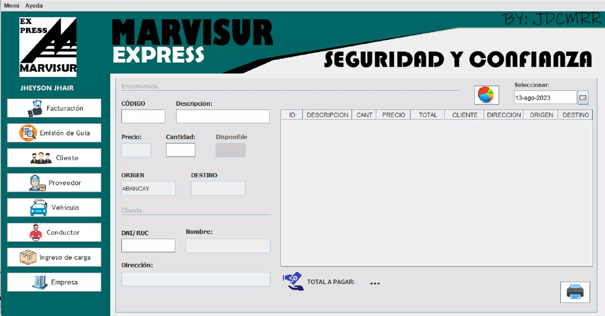

<div align="center">
    <a href="https://github.com/JheysonJhair/encomienda_system.git">
      
    </a>
    <h1>JhairDev - Sistema de encomienda</h1>
    <p align="center">
        Full Stack Developer Jhair
    </p>
</div>




# Aplicación de Gestión de Envío de Paquetes

Bienvenido a la **Aplicación de Gestión de Envío de Paquetes**, un sistema integral diseñado para gestionar el envío de paquetes de manera eficiente y centralizada. Esta aplicación permite administrar todos los aspectos clave relacionados con los envíos, desde la facturación hasta el seguimiento de vehículos y conductores.


## Tecnologías Utilizadas

- **Java**: El lenguaje principal utilizado para implementar la lógica de la aplicación.
- **MySQL**: Base de datos utilizada para almacenar la información de los envíos, facturación y clientes.
- **Swing (Java)**: Para la creación de la interfaz gráfica de usuario (GUI) y la visualización de los datos.


---


## Módulos del Sistema

La aplicación cuenta con los siguientes módulos especializados:

- **Módulo de Facturación**: Permite la gestión de facturas y pagos relacionados con los envíos.
- **Módulo de Productos**: Administra los productos que serán enviados, incluyendo descripciones y precios.
- **Módulo de Cliente**: Gestiona la información de los clientes, permitiendo su registro, actualización y seguimiento.
- **Módulo de Proveedor**: Maneja los proveedores que suministran servicios o productos a la empresa de envíos.
- **Módulo de Vehículo**: Permite gestionar los vehículos utilizados para el transporte de paquetes, incluyendo su mantenimiento y disponibilidad.
- **Módulo de Conductor**: Administra la información de los conductores responsables de los envíos.
- **Módulo de Reporte**: Genera reportes detallados de los envíos, facturación y rendimiento de la flota, con posibilidad de exportación a formatos como PDF o Excel.

---


## Instalación

1. **Requisitos previos**:
   - Tener instalado **Java JDK 17** o superior.
   - Tener configurado **MySQL** en el sistema con un usuario y una base de datos disponibles.

2. **Clonar el repositorio**:
   ```bash
   git clone https://github.com/usuario/app_gestion_envios_paquetes.git
   cd app_gestion_envios_paquetes
   


3. **Ejecuta tu entorno de desarrollo para java y abre el proyecto**

4. **Establece como proyecto de inicio `SistemaEncomienda/SistemaEncomienda.java`.**

5. **Ejecuta la aplicación.**

¡Listo! Ahora puedes comenzar a trabajar en el Sistema sin problemas.
